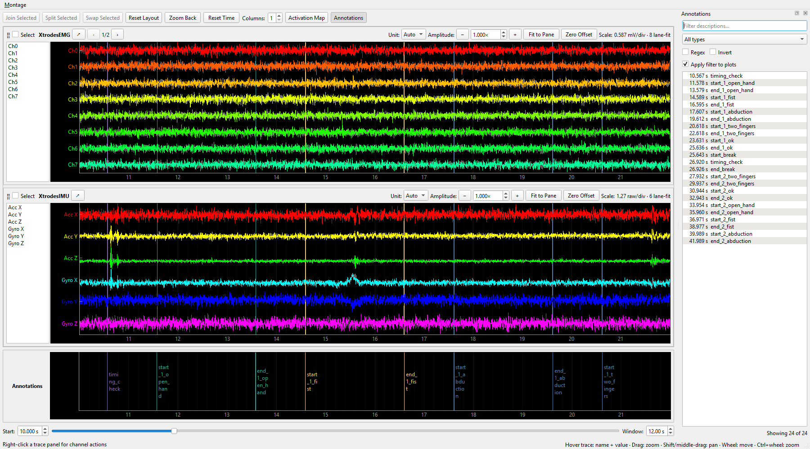

[](LICENSE)

# MNELAB Streams

<p align="center">
  
</p>

MNELAB Streams is a source-aware XDF and signal review application and a community
fork of
[MNELAB](https://github.com/cbrnr/mnelab), the cross-platform desktop interface
for [MNE-Python](https://mne.tools/stable/index.html). It keeps MNELAB's general
EEG/MEG inspection and preprocessing workflow and adds a source-oriented viewer,
stream-specific filtering and power spectra, and a substantially expanded XDF
workflow.

This is an independent fork, not an official upstream MNELAB release. The distribution
and application command are `mnelab-streams`; the internal Python import package remains
`mnelab` for source compatibility.



## What this fork adds

- **Source-aware raw viewer:** organize channels by their originating XDF stream,
  rearrange, join, split, dock, or float panels, and navigate all panels on one
  synchronized timeline.
- **Per-channel display controls:** change visibility, order, gain, vertical offset,
  color, DC removal, and display unit without modifying the stored samples. Inspect
  channel metadata and current-window statistics directly from the viewer.
- **Reusable display montages:** save and load viewer-only layouts as validated JSON.
- **Stream-aware processing:** edit stream definitions and apply independent filters
  to selected channels in each stream, with per-stream Nyquist limits and optional
  notch harmonics.
- **Native PSD viewer:** inspect source-oriented spectra in stacked or overlay mode,
  in linear power or decibels, with safe handling of NaN-padded channels and
  source-specific Nyquist limits.
- **Multi-file XDF workflows:** open selected files or a folder, order recordings by
  time, split at discontinuities, skip unreadable files, merge heterogeneous channel
  sets with NaN padding, preserve source identities, and export a merged dataset back
  to XDF.
- **Hierarchical JSON annotations:** browse supported LSL markers as a collapsible
  hierarchy, hide or reveal UUIDs, and inspect reconstructed start/end lifecycles in
  an annotation-only overview.

The complete implementation audit, including the exact fork comparison range and
behavioral details, is in [FORK_CHANGES.md](FORK_CHANGES.md). The current full product
behavior is specified in
[docs/software-specification.md](docs/software-specification.md), and release-level
changes are recorded in [CHANGELOG.md](CHANGELOG.md).

## Requirements

- Windows, macOS, or Linux
- Python 3.12 or newer
- [uv](https://docs.astral.sh/uv/)

The main runtime uses PySide6/Qt, MNE-Python, MNExtend, NumPy, SciPy, Matplotlib, and
PyQtGraph. Exact minimum versions are declared in [pyproject.toml](pyproject.toml).

## Install and run this fork

Clone the repository:

```shell
git clone --recurse-submodules https://github.com/NitzanLux/mnelab-streams.git
cd mnelab-streams
uv sync --locked --all-extras
uv run mnelab-streams
```

For an existing checkout, initialize or update the nested annotation specification
with `git submodule update --init --remote vendor/lsl-json-annotation-guide`.

For development, install all dependency groups and run the warning-strict test suite:

```shell
uv sync --locked --all-groups --all-extras
uv run pytest -W error tests
```

Run Ruff before submitting code changes:

```shell
uv run ruff check
uv run ruff format --check
```

## Build distributable packages

Generated files are written to `dist/` or `standalone/dist/`. These directories
contain build outputs and should not be committed to Git; publish installers as
release assets instead.

### Python wheel and source archive

From the repository root:

```shell
uv sync --locked --all-groups --all-extras
uv build
```

This creates the `.whl` and `.tar.gz` packages in `dist/`.

### Windows executable and installer

Install
[Inno Setup 6](https://jrsoftware.org/isinfo.php) and ensure `iscc.exe` is on
`PATH`. Then open PowerShell in the repository root:

```powershell
uv sync --locked --all-groups --all-extras
Set-Location standalone
..\.venv\Scripts\Activate.ps1
.\create-standalone-windows.ps1
```

PyInstaller creates the portable application at
`standalone/dist/MNELAB-Streams/MNELAB-Streams.exe`. Keep the executable with the
other files in that folder. Inno Setup then creates the versioned installer
`standalone/MNELAB-Streams-<VERSION>.exe`.

### macOS application and DMG

The macOS packages must be built on macOS. From the repository root:

```shell
uv sync --locked --all-groups --all-extras
cd standalone
uv run python create-standalone-macos.py build-app
uv run python create-standalone-macos.py build-dmg
```

This creates `standalone/dist/MNELAB-Streams.app` and
`standalone/MNELAB-Streams-<VERSION>-<ARCH>.dmg`, where `<ARCH>` is the architecture
of the build machine (`arm64` or `x86_64`) because the bundle is not universal. The
DMG is unsigned by default; public distribution requires Apple code signing and
notarization.

### Linux portable archive

The Linux package must be built on Linux. From the repository root:

```shell
uv sync --locked --all-groups --all-extras
cd standalone
source ../.venv/bin/activate
./create-standalone-linux.sh
```

This creates the portable folder `standalone/dist/MNELAB-Streams` and packs it into
`standalone/MNELAB-Streams-<VERSION>-linux-<ARCH>.tar.gz`. Unpack it anywhere and run
the `MNELAB-Streams` executable inside; there is no installer.

### Building every platform at once

PyInstaller cannot cross-compile, so each target needs a machine of that operating
system and architecture. The **Standalone** GitHub Actions workflow provides all of
them — Windows x64, macOS arm64, macOS x86_64, and Linux x86_64. Run it manually from
the repository's **Actions** page and download the artifacts once the jobs finish.

Pushing a `vX.Y.Z` tag runs the same builds through the **Release** workflow, which
additionally publishes to PyPI and creates a GitHub release whose notes are generated
from `CHANGELOG.md` by `tools/changelog.py`.

## Getting started

### Inspect one recording

1. Choose **File > Open** and select a supported file.
2. Choose **Plot > Data** to open the synchronized raw stream viewer.
3. Use a stream header to fit, rearrange, join, split, dock, or float panels; right-click
   it to set an exact per-stream amplitude such as `100 µV/div`.
4. Right-click a channel for display controls, metadata, statistics, or bad-channel
   status.
5. Use **Display Montage** in the viewer to save or restore the presentation layout.

### Merge XDF recordings

1. Select several XDF files with **File > Open**, or choose
   **File > Open XDF Folder** for recursive folder discovery.
2. Review file order and choose separate loading or sequential merging.
3. For automatic time ordering, set the accepted seam gap/overlap and decide whether
   discontinuities should stop the operation or start a new dataset.
4. Enable heterogeneous-channel merging when recordings do not all contain the same
   channels. Missing intervals are represented by `NaN`.
5. A successful multi-file merge is marked in the dataset tree and information panel.
   Use the XDF export action to write it as a new XDF file.

### Filter or inspect spectra by source

- Choose **Process > Filter**, select source streams and channels on the first page,
  then configure each selected stream independently. Available designs mirror
  EDFbrowser's high-pass, low-pass, notch, band-pass, and band-stop controls,
  including Butterworth, Chebyshev, Bessel, moving-average, notch Q-factor, and
  optional harmonic-notch settings.
- Choose **Plot > Power Spectral Density** for source-oriented stacked or overlay
  spectra. Each source is clipped to its own valid Nyquist range.

## Important behavior

- Display gain, offset, units, color, layout, and DC removal are presentation settings;
  they do not alter the MNE data.
- Multi-rate XDF streams retain their own sample values and measured native timing.
  Versioned explicit timestamps are preserved; legacy buffered timestamps are
  recovered from observed buffer endpoints or a measured sample-clock fit without
  forcing the nominal rate. Acquisition gaps remain missing.
- Filtering, bad-channel changes, and other scientific processing do change dataset
  state and are reflected in MNELAB's history where applicable.
- A display montage is not a sensor montage. It stores viewer presentation only.
- The merged-XDF writer is available for raw datasets assembled from multiple XDF
  files. It validates channel ownership before replacing the destination atomically.
- MNELAB Streams is research software. It is not a data-acquisition system or clinical
  diagnostic device.

## Upstream documentation and contribution

General MNELAB usage is documented in the
[upstream documentation](https://mnelab.readthedocs.io/). Fork-specific behavior is
documented in this repository.

Before contributing, read [CONTRIBUTING.md](CONTRIBUTING.md). Source and test files
must retain the repository's BSD license header, and every change should include
tests and a changelog entry.

## Design acknowledgements

Some stream-viewer interaction concepts—including time-navigation gestures,
current-window channel statistics, and zoom-history behavior—were inspired by
[EDFbrowser](https://github.com/RTMilliken/EDFbrowser), a separate project
distributed under the GNU General Public License version 2. This acknowledgment
does not imply affiliation with or endorsement by the EDFbrowser project.

## License and attribution

This fork remains licensed under the
[BSD 3-Clause License](LICENSE). The original copyright notice, license conditions,
and warranty disclaimer are retained in the repository.

Source redistributions must retain that notice, the three conditions, and the
disclaimer. Binary redistributions must reproduce them in the accompanying
documentation or other materials. The names of the copyright holder and contributors
may not be used to endorse or promote derived products without prior written
permission.

MNELAB was created by the MNELAB developers and upstream contributors. Fork-specific
work is identified in [CHANGELOG.md](CHANGELOG.md) and
[FORK_CHANGES.md](FORK_CHANGES.md). No upstream endorsement of this fork is implied.
Additional provenance is recorded in [NOTICE](NOTICE).
